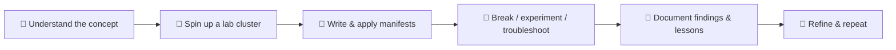

Here’s a **clean, professional, and visually attractive** README you can drop straight into your repository (no fluff, just the good stuff). I’ve used tasteful badges, icons, a small table/flow, and subtle color accents — not over-designed or “designer-y”, just polished and easy to scan:

---

# ☸️ Kubernetes Lab  

  
  
  <h2>🚀 Hands-On Kubernetes Learning Journey</h2>
  
  
<em>Learn by building, breaking, and documenting real Kubernetes clusters & workloads.</em>

  
  
  
  

  
  

---

## 🧭 Overview

This repository is a **structured, practical knowledge base** for mastering Kubernetes. Every topic is backed by hands-on labs, tested YAML manifests, troubleshooting notes, and real-world deployment examples — so you understand *how* and *why* things work in production-like environments (not just the commands).

---

## 🧰 What's Inside

| 📚 Documentation | 🧪 Hands-On Labs | 🧾 Manifests & Configs | 🚀 Projects |
| :-- | :-- | :-- | :-- |
| Architecture deep-dives • Command references • Troubleshooting guides • Best practices | Cluster setup (kind/kubeadm) • Workloads • Networking • Storage • RBAC & Security | Deployments / Services / Ingress • PV/PVC • ConfigMaps & Secrets • Helm charts (where applicable) | End-to-end, real-world deployment mini-projects |

---

## 🎯 Learning Objectives

- 🧱 Build a solid understanding of core objects (Pods, Deployments, StatefulSets, DaemonSets, Jobs/CronJobs)  
- 🌐 Design and troubleshoot networking (CNI, Services, Ingress, NetworkPolicies)  
- 💾 Manage persistent and ephemeral storage (PV/PVC, StorageClasses)  
- 🔐 Implement RBAC, ServiceAccounts, and basic security controls  
- 🛠️ Debug clusters effectively with `kubectl`, logs, and events  
- 📦 Package and deploy with Helm fundamentals  
- 🧪 Practice GitOps-flavoured workflows and reproducible labs  

---

## 🛤️ Learning Methodology

---

## 🧩 Key Focus Areas

---

## 🤝 Contributing

Contributions are welcome! If you spot errors, have better examples, or want to add new labs/notes, feel free to open an issue or submit a PR.  

---

## 👨‍💻 Author

**Krishna Prajapat**  
[🔗 GitHub](https://github.com/Krishnaa-21)

---

  ⭐ Star this repo if it helps accelerate your Kubernetes journey!

---

Want me to tailor this further (e.g., add a table of contents, specific folder links, or a dark-mode friendly palette)? Just let me know.